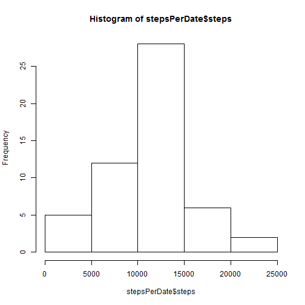
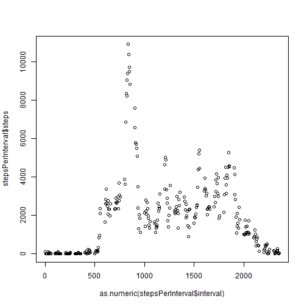
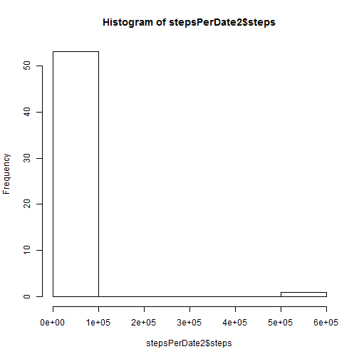
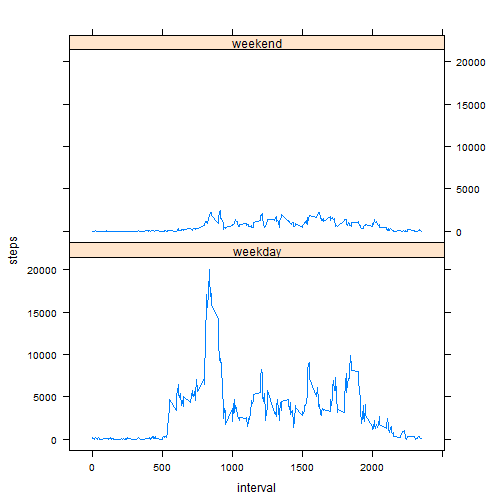

This document represents a solution for Peer Assesment project 1 in Coursera's Reproducible research

## Loading and preprocessing the data
Let's load the data first


```r
data = read.csv("activity.csv", colClasses = c("numeric", "character", "numeric"), sep = ",")
summary(data)
```

```
##      steps           date              interval   
##  Min.   :  0.0   Length:17568       Min.   :   0  
##  1st Qu.:  0.0   Class :character   1st Qu.: 589  
##  Median :  0.0   Mode  :character   Median :1178  
##  Mean   : 37.4                      Mean   :1178  
##  3rd Qu.: 12.0                      3rd Qu.:1766  
##  Max.   :806.0                      Max.   :2355  
##  NA's   :2304
```

```r
head(data)
```

```
##   steps       date interval
## 1    NA 2012-10-01        0
## 2    NA 2012-10-01        5
## 3    NA 2012-10-01       10
## 4    NA 2012-10-01       15
## 5    NA 2012-10-01       20
## 6    NA 2012-10-01       25
```


##What is mean total number of steps taken per day?
Let's see how many steps are made per day

First load the ggplot2 library

```r
library(ggplot2)
```

Then lets aggregate steps made per day to a new data set


```r
stepsPerDate = aggregate(cbind(steps) ~ date, data = data, FUN = sum)
head(stepsPerDate)
```

```
##         date steps
## 1 2012-10-02   126
## 2 2012-10-03 11352
## 3 2012-10-04 12116
## 4 2012-10-05 13294
## 5 2012-10-06 15420
## 6 2012-10-07 11015
```

```r
summary(stepsPerDate)
```

```
##      date               steps      
##  Length:53          Min.   :   41  
##  Class :character   1st Qu.: 8841  
##  Mode  :character   Median :10765  
##                     Mean   :10766  
##                     3rd Qu.:13294  
##                     Max.   :21194
```

Let's show histogram of steps per day


```r
hist(stepsPerDate$steps)
```

 

Let's also calculate mean

```r
mean(stepsPerDate$steps)
```

```
## [1] 10766
```
and median

```r
median(stepsPerDate$steps)
```

```
## [1] 10765
```

##What is the average daily activity pattern?

Let's calucate the average number of steps in each interval


```r
stepsPerInterval = aggregate(cbind(steps) ~ interval, data = data, FUN = sum)
stepsPerInterval$interval = as.numeric(as.character(stepsPerInterval$interval))
head(stepsPerInterval)
```

```
##   interval steps
## 1        0    91
## 2        5    18
## 3       10     7
## 4       15     8
## 5       20     4
## 6       25   111
```

```r
summary(stepsPerInterval)
```

```
##     interval        steps      
##  Min.   :   0   Min.   :    0  
##  1st Qu.: 589   1st Qu.:  132  
##  Median :1178   Median : 1808  
##  Mean   :1178   Mean   : 1981  
##  3rd Qu.:1766   3rd Qu.: 2800  
##  Max.   :2355   Max.   :10927
```

Show a plot of average number of steps per interval

```r
plot(as.numeric(stepsPerInterval$interval), stepsPerInterval$steps)
```

 

Which interval contains the most steps on average?

```r
stepsPerInterval[which.max(stepsPerInterval[,2]),]
```

```
##     interval steps
## 104      835 10927
```

##Imputing missing values

What is the total number of rows with missing values?

```r
sum(is.na(data$steps))
```

```
## [1] 2304
```

Let's fill in the missing numbers. Let's put in mean of number of steps for each interval

```r
data2 = data
data2 <- within(data2, steps <- ifelse(is.na(steps), stepsPerInterval[stepsPerInterval[, "interval"] == interval,2], steps))
```


```r
stepsPerDate2 = aggregate(cbind(steps) ~ date, data = data2, FUN = sum)
head(stepsPerDate2)
```

```
##         date  steps
## 1 2012-10-01 570608
## 2 2012-10-02    126
## 3 2012-10-03  11352
## 4 2012-10-04  12116
## 5 2012-10-05  13294
## 6 2012-10-06  15420
```

```r
summary(stepsPerDate2)
```

```
##      date               steps       
##  Length:54          Min.   :    41  
##  Class :character   1st Qu.:  8860  
##  Mode  :character   Median : 10890  
##                     Mean   : 21134  
##                     3rd Qu.: 13412  
##                     Max.   :570608
```

Show histogram for updated data set


```r
hist(stepsPerDate2$steps)
```

 

Let's also calculate mean of updated data set

```r
mean(stepsPerDate2$steps)
```

```
## [1] 21134
```
and median

```r
median(stepsPerDate2$steps)
```

```
## [1] 10890
```


##Are there differences in activity patterns between weekdays and weekends?

Prepare the new data set. Use the dataset with filled in missing values.
Convert the date field to date type.
Add weekdays column indicating day of week.
Add weekend column indicating if the day of week is weekend day and week day.


```r
data2 = data
data2 <- within(data2, steps <- ifelse(is.na(steps), stepsPerInterval[stepsPerInterval[, "interval"] == interval,2], steps))
data2$date <- strptime(data2$date, "%Y-%m-%d")
data2$weekdays <- weekdays(data2$date)
data2 <- within(data2, weekend <- ifelse(weekdays == "Saturday" | weekdays == "Sunday", "weekend", "weekday"))
```

Calculate averages per interval for weekend and weekday separately


```r
data2Weekend = data2[data2[,"weekend"] == "weekend",]
stepsPerIntervalWeekend = aggregate(cbind(steps) ~ interval, data = data2Weekend, FUN = sum)
stepsPerIntervalWeekend$weekend = "weekend"

data2Weekday = data2[data2[,"weekend"] == "weekday",]
stepsPerIntervalWeekday = aggregate(cbind(steps) ~ interval, data = data2Weekday, FUN = sum)
stepsPerIntervalWeekday$weekend = "weekday"

spiCombined = rbind(stepsPerIntervalWeekend, stepsPerIntervalWeekday)
```

Show the combined plot comparing weekend and weekday averages per interval


```r
library(lattice)
xyplot(steps ~ interval | weekend, data = spiCombined, layout = c(1,2), type="l")
```

 


